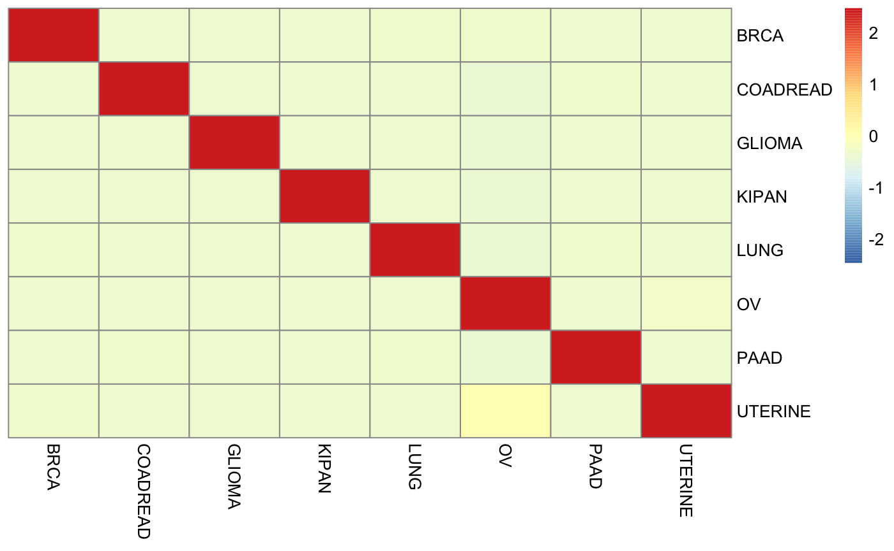

## Introduction
**GT-Classifier** is a machine learning-based model, specifically designed to transform the field of oncology. Leveraging a unique set of 71 GT (glycosyltransferase) genes, it has the capability to predict a wide array of cancer types and subtypes with high accuracy. It also provides valuable prognostic information by predicting survival probabilities. These predictions can empower clinicians and patients by providing them with a comprehensive understanding of the disease.

**The pipeline for the development of a CPGT-based predictive model in a set of cancer-related problems** 
<br>
<br>


<br>

## Data Preparation
For all pan-cancer The Cancer Genome Atlas Program(TCGA) data, we downloaded it from the [link](https://portal.gdc.cancer.gov/). As for our external validation set of The Metastatic Breast Cancer(CMI-MBC) and Clinical Proteomic Tumor Analysis Consortium(CPTAC), we also downloaded from the [link](https://portal.gdc.cancer.gov/).
Especially, the external dataset Chinese Glioma Genome Atlas(CCGA) is downloaded from [link](http://www.cgga.org.cn/).

After gaining all source data, we extracted 71 GT-genes and removed missing values. And we also collect the data that contains the cancer subtypes and paintent ID information. You can download all processed GT data from [Data](https://github.com/luyao-yang/GT-classifier/tree/main/Data)


After processing, the TCGA data should look like:

```
$Data/
    ### Data for Breat cancer subtypes classification
    BRACA_data/
        BRCA_47_genes.txt/ # List of 47 genes used to classify breast cancer subtypes
        BRCA_IHC_pam50.csv/ # 71 gene expression and corresponding pam50 and IHC labeling of breast cancer subtypes
    ### Data for Glioma cancer subtypes classification
    Glioma_data/
        Glioma_50_genes.txt/ # List of 50 genes used to classify Glioma cancer subtypes
        Glioma_sub_genes.txt/ # 50 gene expression and corresponding true labeling of Glioma cancer subtypes
    ### Data for 27 cancers classification
    pan-cancer_data/
        27_cancers.csv/ # 27 types of cancer and the corresponding expression of 71 genes
        71_genes.csv/ # List of 71 GT genes
        normalcancer.csv/ # Normal and cancer patients and expression values of 71 genes
        CPTAC.csv/ # CPTAC dataset as external test set validation

```

For the **external validation** datasets, The structure is like this:
```
$Data/
    ### Data for external validation
    external_data/
        CPTAC.csv/ # CPTAC cancers types with 71 genes
        CMI/
            CMI_GTs.csv # CMI breast cancer subtypes with the 47 genes
            CMI_pam50.csv # CMI breast cancer subtypes with 50 pam50 genes

```

For **survival analysis** datasets, the CPTAC dataset is used for validate the cancertypes model. The CMI is used for validate the Breastsubtypes model. the structure is like this:
```
$Data/
    ### Data for 27 cancers classification
    survival_data/
        CGGA_693_gt50.csv
```

- **CMI_data**  
    This folder includes the BRCA sutypes and extracted defferential genes from CMI-MBC. We also extracted the PAM50 genes from CMI-MBC for the comparison with PAM50 with our differential genes.

- **survival_data**
    This folder including two main datasets. One includes 693 patients, and the other includes 325 patients. We save the genes data and corresponding clinical data.


## Content
The folder **Deg** mainly provids the codes for genetic differential analysis based on GT genes of some cancer subtypes.
For the four main tasks in the article: 
* Pan-cancer classification 
* Cancer and normal classification 
* Cancer subtype classification 
* Patient survival analysis

We have four main codes in folder src which are corresponding to corresponding tasks. At the same time, we put all four trained models into folder **models** for everyone to test the results.

## Requirements

R version: 4.1.3
[Rstudio](https://posit.co/download/rstudio-desktop/)
BiocManager: 3.14

You can download the R version **4.1.3** for **windows** from [here](https://cran.r-project.org/bin/windows/base/old/). For Mac and For linux.

All codes run in R markdown format. You need to install the R markdown package in advance. Use the following command:
```
install.packages('rmarkdown')
```

Using the following commands to install the packages (for example):
```
install.packages("xgboost")
BiocManager::install('TCGAbiolikns')
```


## Demo

Before run the code, please set the work directory to **GT-classifier** using the command:
```
setwd("path-your-dir/GT-classifier")
getwd() 
```

#### Training
Please make sure a created **models** under the **GT-classifier**.
```
dir.create("models")
```

Run the code files in src directly as required. The different four **.Rmd files represent four tasks corresponding to the article. The R packages that need to be installed for each file are listed at each head of the file.

After running the code, you will get the trained model under the models directory.

#### Evaluation
For the evaluation of 27 cancer classification model on the external dataset CPTAC, we provide the Test Deomo code:


```r
### Import the testing Data
testing_data <- read.csv("../Data/external_data/CPTAC.csv",header = T)
pp = preProcess(x=testing_data, method = c("scale","center","YeoJohnson"),na.remove=TRUE)
pp_testing_data   = predict(pp, testing_data)

### load the pretrained model
modelPath <- ("../models/cancertypes.rds")
model <- readRDS(modelPath)

### predict on the external data
preds <- predict(model,pp_testing_data[,!colnames(pp_testing_data) %in% c(".id")])
#predicted_labels <- factor(model_predictions, levels = unique(all_possible_classes))

### generate the confusion matrix
predicted_labels <- factor(preds, levels = unique(pp_testing_data$.id))
confmat <- confusionMatrix(predicted_labels,as.factor(pp_testing_data$.id))

### Draw the pheatmap
result = pheatmap(confmat$table, scale = "column", cluster_rows=FALSE, cluster_cols=FALSE)
```

After running the test_demo, you will get the heatmap of the model on the CPTAC testing data:




You can change the dirctory and model name to validate other external datasets using the test demo.

## Contact
If you have any questions in this repo, please contact email: luyao.yang@kaust.edu.sa or jing.kai@kaust.edu.sa


